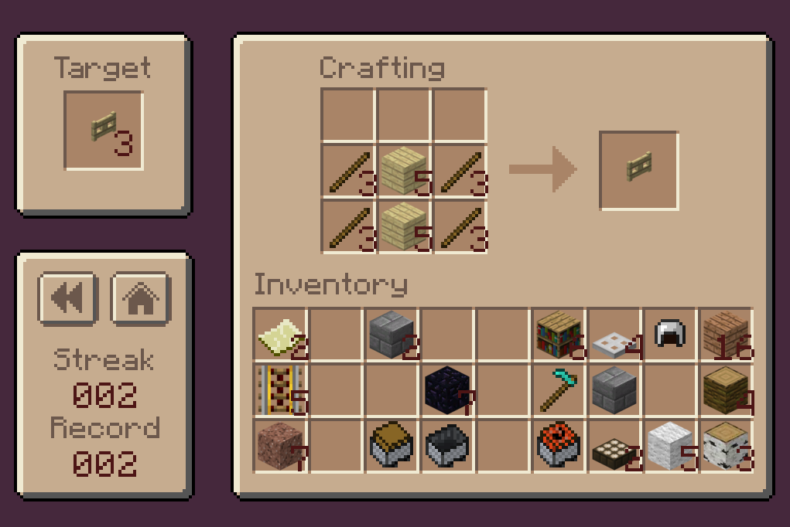

# Craftle-Royale

Craftle Royale is a wordle-style minigame where players test their knowledge of Minecraft recipes though randomized crafting puzzles. 

## Running

This repo contains the complete game files and can cloned to run or build the game in Unity.

*Note: Craftle Royale is optimized for 1024x768 resolution.*

## Misc

Recipes and items based on Minecraft version 1.11.

Since this game is primarily focused on multistep recipes, some one/two step recipes were omitted.

## Credit

This project was built by Vincent Johnson.

Images for block and item sprites from the [Minecraft Wiki](https://minecraft.fandom.com/wiki/Minecraft_Wiki).

Item ID/Metadata based on [this list](https://minecraft-ids.grahamedgecombe.com/) from Graham Edgecombe.
